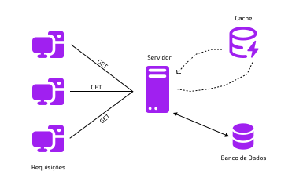

# Arquitetura-de-Software

# **Arquitetura Inicial**


### Resumo Técnico:

- **Fluxo de Requisição**
    - O **front-end** faz uma requisição para um domínio.
    - Essa requisição passa por um **DNS (Domain Name System)**, que converte o domínio em um **endereço IP** do servidor onde a API está hospedada.
    - A requisição segue até o **servidor**, que executa a API.
- **Processamento**
    - O servidor recebe a requisição, processa no **controller/endpoint** da API e, se necessário, acessa o **banco de dados** (que está instalado no mesmo servidor da aplicação).
    - A resposta  em **JSON** é enviada de volta ao front-end.
- **Problemas da Arquitetura Inicial**
    - **Banco e aplicação no mesmo servidor**: eles **competem por recursos**, o que pode sobrecarregar o servidor e aumentar a lentidão.
    - **Ponto único de falha**: se esse único servidor cair, **toda a aplicação fica indisponível**.
    - **Baixa escalabilidade**: essa estrutura não foi feita para aguentar muitos acessos simultâneos. Crescer com ela exige mudanças graduais.
    
    ### Conclusão Técnica
    
    Essa arquitetura inicial é **simples e funcional para começar**, mas **não é escalável nem resiliente**. É o ponto de partida, e à medida que o sistema cresce, será preciso:
    
    - **Separar banco de dados da aplicação**
    - **Distribuir a carga**
    - **Garantir alta disponibilidade e redundância**

# Separação dos Servidores


Antes, o **código da aplicação (API)** e o **banco de dados** estavam no mesmo servidor. Agora, eles foram **separados em dois servidores diferentes**:

- **Servidor 1:** Hospeda a aplicação (API).
- **Servidor 2:** Hospeda o banco de dados.

### Como funciona agora?

1. O front-end ainda faz a requisição para API passando pelo **DNS**.
2. O DNS converte o domínio para o IP do **servidor da API**.
3. A API processa a requisição e, **quando necessário**, se comunica com o servidor do banco de dados.
4. A resposta é devolvida ao front-end em **JSON**, como antes.

---

### Vantagens dessa separação

- **Melhor desempenho:** Agora, a API e o banco **não disputam mais memória e CPU**, o que reduz lentidão e gargalos.
- **Escalabilidade independente:** Podemos aumentar os recursos (CPU, memória, disco) **de forma separada** para a aplicação ou o banco, conforme a demanda.
- **Organização e manutenção mais simples:** Problemas podem ser tratados de forma isolada.

---

### Mas ainda temos desafios:

- **Ponto único de falha persiste:** Se o servidor da API ou o do banco cair, **a aplicação toda para**.
- **Não é suficiente para milhões de usuários:** Essa é uma ótima estrutura inicial, porém **ainda não escala automaticamente**. É um **passo inicial importante**, mas estamos longe de uma arquitetura tolerante a falhas e de alta disponibilidade, o que será super importante ao decorrer do crescimento do projeto.

---

### Conclusão

Essa etapa é uma **melhoria gradual** que **prepara a base para escalar**, mas ainda precisa evoluir para lidar com **altas cargas e garantir estabilidade**. O próximo passo será tratar de **escalabilidade horizontal, balanceadores de carga e réplicas de banco**, por exemplo.

# Porque optamos pela escala horizontal?

Nosso objetivo é desenvolver uma aplicação capaz de lidar com um grande volume de requisições a longo prazo. Embora a **escala vertical** ofereça mais capacidade de processamento ao aumentar os recursos de um único servidor, ela possui **limites físicos** e **custo elevado**. Além disso, mantém um **ponto único de falha** — se esse único servidor falhar, toda a aplicação fica indisponível.

Já a **escala horizontal** nos permite distribuir a carga entre **vários servidores**, garantindo uma **arquitetura altamente disponível e resiliente**. Essa abordagem é essencial, especialmente considerando que alguns usuários utilizam a plataforma como **fonte de renda** — não podemos correr o risco de deixá-la fora do ar.

Por isso, adotamos estratégias de **redundância** e **failover**, que garantem a continuidade dos serviços: se um servidor falhar, outro assume automaticamente seu lugar, mantendo o sistema funcional.


Demonstração de escala vertical e escala horizontal

# Escala Horizontal com Load Balancer


Para suportar um grande volume de acessos e garantir que nossa aplicação continue disponível mesmo em momentos de pico ou falhas, adotamos a estratégia de **escala horizontal**, utilizando um **Load Balancer** (balanceador de carga).

### Como funciona:

- Criamos **réplicas da nossa aplicação (API)** e as colocamos para rodar em servidores diferentes.
- O **Load Balancer** recebe todas as requisições do front-end (web/mobile) e **distribui automaticamente** entre os servidores disponíveis.
- Agora, ao invés de o domínio apontar diretamente para a aplicação, ele aponta para o **IP público do Load Balancer**.
- As **instâncias da API** ficam com IPs privados e **não são acessíveis diretamente da internet** — uma boa prática de segurança.
- Em ambientes cloud (como AWS, Azure ou GCP), tudo isso é configurado facilmente em uma rede privada.

---

### **Vantagens dessa Arquitetura:**

- **Alta disponibilidade:** se uma instância falhar, outra continua atendendo (failover).
- **Escalabilidade:** podemos subir novas instâncias conforme a demanda aumenta, e o Load Balancer se encarrega da distribuição.
- **Segurança aprimorada:** servidores da aplicação não estão diretamente expostos à internet.

---

### **Desafios encontrados:**

- Ainda temos **um ponto único de falha no banco de dados**.
    - Todas as instâncias da aplicação se conectam ao **mesmo banco**.
    - Mesmo escalando verticalmente (mais CPU, RAM), o banco **tem limites físicos**.
    - Além disso, **uma falha nesse único servidor de banco de dados comprometeria toda a aplicação**.

---

### **Próximo passo técnico:**

Para resolver esse gargalo e preparar a aplicação para **milhões de usuários**, a próxima evolução será aplicar **replicação de banco de dados (Database Replication)** — garantindo:

- **Redundância de dados**
- **Alta disponibilidade**
- **Distribuição de leitura entre réplicas**

# Database Replication

Para resolver o problema de sobrecarga no banco de dados — causado por múltiplas instâncias da aplicação acessando o mesmo banco — aplicamos a estratégia de **replicação de dados**, separando os papéis de escrita e leitura.


### Como funciona?

- O banco de dados principal passa a ser o **Master**, responsável por todas as operações de **escrita**: `INSERT`, `UPDATE` e `DELETE`.
- Criamos **réplicas**, chamadas de **Slaves**, que são responsáveis pelas **leituras** (`SELECT`).
- Isso reduz drasticamente a carga no banco master e aumenta o desempenho geral da aplicação.
- O meio mais comum de comunicação entre a escrita e leitura é  a conexão direta que é simples de se fazer.

---

- **Exemplo prático de configuração (Laravel)**
    
    A maioria dos frameworks e ORMs (como Laravel, Sequelize, TypeORM etc.) permite configurar leitura e escrita separadamente:
    

```php
'mysql' => [
    'read' => [
        'host' => [
            '192.168.1.1',
            '196.168.1.2',
        ],
    ],
    'write' => [
        'host' => [
            '196.168.1.3',
        ],
    ],
]
```

Com isso:

- As **escritas** são direcionadas ao `192.168.1.3` (master).
- As **leituras** são balanceadas automaticamente entre os hosts `192.168.1.1` e `192.168.1.2` (slaves).

---

### Alternativa com Aurora (AWS)

O **Amazon Aurora** permite configurar um **cluster**  —  computadores fracamente ou fortemente ligados que trabalham em conjunto — com réplicas de leitura, fornecendo **apenas um endpoint único** para conexão. A própria AWS se encarrega do balanceamento de carga entre os bancos internos, otimizar desempenho e resiliência.

---

### Benefícios:

- **Alta disponibilidade:** se um banco falhar, outro assume automaticamente.
- **Escalabilidade de leitura:** podemos adicionar múltiplos slaves para aguentar grandes volumes de acesso.
- **Desempenho otimizado:** separando leitura de escrita, evitamos gargalos e aumentamos a capacidade de resposta do sistema.
- **Segurança dos dados:** com réplicas atualizadas em tempo real, o risco de perda de dados é minimizado.

# Arquitetura com Replicação de Banco de Dados


Aplicação com nível de arquitetura robusta e escalável, com alta disponibilidade e preparação para grandes volumes de acesso simultâneo.

### Como Funciona?

1° O usuário (web ou mobile) faz uma requisição para o domínio da API.

2° O **DNS** converte esse domínio no IP do **Load Balancer**.

3° O **Load Balancer** distribui as requisições entre múltiplas instâncias da API (horizontalmente escaladas).

4° As instâncias:

- Enviam **escritas** (`INSERT`, `UPDATE`, `DELETE`) para o banco **Master**.
- Realizam **leituras** (`SELECT`) a partir dos bancos **Slaves** (réplicas).

5° Um mecanismo de **replicação assíncrona** mantém os dados atualizados entre o Master e os Slaves.

---

### Benefícios Alcançados:

| Camada | Benefício |
| --- | --- |
| **API (Web)** | Alta disponibilidade, balanceamento de carga e escalabilidade horizontal. |
| **Banco de Dados** | Separação de leitura e escrita o que reduz gargalos e melhora o desempenho. |
| **Infraestrutura** | Redundância, failover automático e segurança (IPs privados nas instâncias). |

---

### Novo desafio: Consistência Eventual

Com o uso de replicação assíncrona no banco de dados, as informações gravadas no banco **Master** levam alguns milissegundos (ou mais) para serem replicadas para os bancos **Slaves**. Esse pequeno atraso pode gerar inconsistências temporárias — um fenômeno chamado **consistência eventual**.

---

### Exemplo prático no contexto da Rivalix:

- O **usuário A** cria um novo torneio na plataforma → a informação é gravada no banco **Master**.
- Quase ao mesmo tempo, o **usuário B** acessa a tela “Descubra Torneios” → a aplicação realiza uma **leitura em um banco Slave**.
- **Resultado:** o novo torneio **ainda não aparece** para o usuário B, pois os dados ainda estão sendo replicados do Master para o Slave.

### Por que isso importa?

Em uma plataforma onde **tempo real e interações imediatas** fazem parte da experiência (como em torneios, atualizações de perfil, recompensas, etc…), é importante entender esse comportamento. Embora momentâneo, ele pode causar estranhamento ao usuário se não for tratado corretamente.

---

### Estratégias para mitigar o problema

| Estratégia | Vantagem | Limitação |
| --- | --- | --- |
| Leitura temporária no Master após escrita | Garante consistência | Aumenta carga no Master |
| Delay artificial na resposta | Evita leitura "vazia" | Aumenta latência |
| Confirmação só após replicação | Segurança de consistência | Risco de travar se um Slave falhar |
| Cache local pós-escrita | Resposta rápida ao usuário | Requer lógica de invalidação |

> Em nossa arquitetura, aceitamos a consistência eventual como parte do trade-off para garantir alta disponibilidade e escalabilidade.
> 

---

## Próximos passos

Mesmo com uma arquitetura sólida, o foco é **melhorar a performance da aplicação** sem depender apenas do banco de dados.

---

### Próxima etapa: Adicionar uma Camada de Cache

A inclusão de um cache trará ganhos importantes:

- Diminui o número de acessos diretos ao banco (principalmente para leituras repetidas).
- Reduz a latência de resposta.
- Alivia a carga nos bancos Slaves e no Master.
- Pode armazenar respostas por rota, por usuário ou por chave específica (ex.: torneios mais acessados).

# Adicionar uma camada de cache.

Para melhorar a **performance da aplicação** e reduzir o número de requisições diretas ao banco de dados, implementamos uma **camada de cache**.

---

### Por que usar cache?


- Alguns dados são **muito requisitados** com frequência e não mudam o tempo todo (ex: listagens, catálogos, dashboards).
- Buscar esses dados repetidamente no banco **sobrecarrega** a camada de persistência e **aumenta a latência** da resposta.
- A **camada de cache** armazena esses dados temporariamente **na memória RAM**, oferecendo acesso **muito mais rápido**.

---

### cache aside pattern (Cache a parte)



### Fluxo de Funcionamento:

1. O servidor **verifica primeiro no cache**.
2. Se o dado existir (cache hit), **retorna direto** para o usuário.
3. Se **não existir** (cache miss):
    - Busca o dado no banco de dados.
    - **Atualiza o cache** com esse dado.
    - Retorna para o usuário.

→ A próxima requisição encontrará o dado diretamente no cache, **sem precisar bater no banco**.

Com isso, aliviamos muito nossa camada de persistência, deixando o banco de dados não ser preciso ser requisitado em determinadas buscas de dados.

---

### Exemplo Prático: (Ilustrativo)

```php
SECONDS = 1
cache.set('myKey', 'xyz', 3600 * SECONDS)  # TTL de 1 hora
cache.get('myKey')
```

- **cache.set**: define uma chave, valor e tempo de expiração (TTL).
- **cache.get**: tenta obter o valor da chave diretamente do cache.

A biblioteca/ferramenta utilizada no exemplo foi o **Redis**, um dos sistemas de cache mais populares.

---

# Arquitetura com servidores cache


A introdução da **camada de cache** trará ganhos enormes de desempenho à arquitetura. No entanto, ao utilizar **apenas um servidor de cache**, voltamos ao **problema do ponto único de falha**: se o cache ficar fora do ar, a aplicação pode enfrentar **erros graves ou lentidão extrema** ao tentar buscá-lo.

---

### O risco do cache único

- Um único servidor de cache pode falhar por instabilidade, queda de rede ou manutenção.
- Se a aplicação não conseguir se conectar ao cache, ela tenta recorrer diretamente ao banco de dados — o que **aumenta a carga** e pode **derrubar todo o sistema** em cenários de tráfego intenso.

---

### Solução: Cache com Redundância (Cluster)

Para evitar esse problema, a solução é **provisionar múltiplos servidores de cache**, formando um **cluster com failover e balanceamento de carga**.

- **Serviços como o ElastiCache da AWS** (usando Redis Cluster, por exemplo) já oferecem essa estrutura pronta.
- Você configura apenas **um único endpoint público**, e o sistema distribui as requisições internamente entre os nós do cluster.
- Isso garante que, se um nó falhar, **outros assumem automaticamente**, sem impacto visível na aplicação.

---

# Arquitetura com Elasticidade

Elasticidade significa tornar a **escalabilidade horizontal automática**, permitindo que a infraestrutura **aumente ou diminua a quantidade de instâncias de forma dinâmica**, com base na demanda.


### Como funciona?

- Definimos um número **mínimo e máximo de instâncias** (ex.: 2 a 7).
- A provedora de nuvem (como AWS) **monitora o tráfego** e, conforme a necessidade:
    - **Aumenta** o número de instâncias quando o tráfego cresce.
    - **Reduz** automaticamente quando o tráfego diminui.
- Tudo isso é feito por meio de serviços como o **Auto Scaling Group**, **EC2** (máquinas virtuais) e **Load Balancer**.

### Vantagens da Elasticidade

| Vantagem | Resultado |
| --- | --- |
| **Alta performance sob demanda** | Atende picos de tráfego (ex: Black Friday) sem intervenção manual. |
| **Custo otimizado** | Você só paga pelas instâncias que estiverem ativas conforme o uso. |
| **Redução de risco de falhas** | A escalabilidade é contínua e automática, reduzindo gargalos. |

---

Mesmo com toda essa arquitetura elástica, **há um risco crítico** se tudo estiver concentrado em **um único data center.**

Se ocorrer um desastre (incêndio, falha elétrica, enchente) no data center onde sua aplicação está hospedada, **toda a infraestrutura pode sair do ar**, incluindo:

- Load Balancer
- Instâncias de aplicação
- Banco de dados
- Cache

Isso volta a representar um **ponto único de falha**, **em nível físico e geográfico**.

---

# Solução: Redundância entre Regiões


- A arquitetura precisa ser **distribuída entre múltiplos data centers (zonas de disponibilidade)**.
- Em nuvens como AWS, você pode replicar sua aplicação entre regiões (ex.: São Paulo e Ohio).
- Em caso de falha catastrófica em uma região, outra assume **automaticamente ou via failover manual**.

---

### Replicação entre Data Centers

Essa redundância global introduz um novo tipo de complexidade:

**→ Como manter os dados sincronizados entre data centers diferentes?**

### Exemplo:

- O usuário faz um `INSERT` no banco do data center de São Paulo.
- Pouco tempo depois, outro usuário conectado ao data center de Ohio tenta ler esse dado.
- **Se os dados não forem replicados entre as regiões**, ele não verá a informação atualizada.

---

### Solução: Replicação entre regiões

- Implementamos **mecanismos de replicação cross-region** (entre data centers).
- Esses mecanismos precisam lidar com:
    - Diferença de latência (por estarem em países diferentes).
    - Estratégias de consistência eventual.
    - Possíveis conflitos de escrita (caso os dois lados recebam atualizações simultâneas).

> Esse é um cenário comum em empresas de alta escala como a Netflix, que descreve em detalhes essa abordagem no blog técnico de arquitetura deles.
> 

---

### O que conquistamos com essa evolução

| Resultado | Descrição |
| --- | --- |
| **Alta disponibilidade geográfica** | Mesmo que um data center inteiro falhe, outro assume imediatamente. |
| **Resiliência contra desastres naturais** | Incêndios, enchentes, quedas de energia… tudo contornado. |
| **Zero downtime perceptível** | Failover transparente para o usuário final. |
| **Escalabilidade global** | Atendemos usuários mais próximos da sua localização, reduzindo latência. |

---

### Conclusão até aqui

> A arquitetura agora conta com:
> 
- Escalabilidade horizontal com múltiplas instâncias e balanceamento de carga.
- Banco de dados com replicação (master/slaves).
- Camada de cache com cluster.
- Elasticidade automática com Auto Scaling.
- E agora: planejamento para **disponibilidade multi-regional**.

---

# Mensageria

### O que é mensageria?

**Mensageria** é um mecanismo de troca de mensagens entre partes da aplicação (ou entre serviços) de forma **assíncrona** e **desacoplada**. É amplamente utilizada em arquiteturas modernas para:

- Comunicação entre **microsserviços**
- **Arquiteturas orientadas a eventos (Event-Driven)**
- Processamento de **tarefas pesadas em background**
    
    (→ foco da nossa implementação)
    

---


### Componentes envolvidos:

| Componente | Função |
| --- | --- |
| **Fila (mensageria)** | Armazena a mensagem da tarefa pendente. |
| **Producer** | A aplicação que envia a mensagem (ex.: após receber uma requisição). |
| **Consumer (ou Worker)** | Serviço responsável por ler a fila e executar a tarefa. |

### O problema que queremos resolver

Quando o servidor executa tarefas **pesadas diretamente** dentro da requisição do usuário (ex.: geração de relatórios), ocorre:

- **Atraso na resposta**
- **Carga alta** no servidor principal
- **Experiência ruim para o usuário**
- E risco de **queda de performance** em picos de tráfego

---

### Solução: Processamento assíncrono com mensageria


### Como funciona o fluxo:

1. O usuário envia uma requisição (ex: compra dentro da plataforma).
2. A aplicação **dispara uma mensagem para a fila** (ex.: via RabbitMQ, SQS, etc).
3. A aplicação já responde **OK para o usuário**, dizendo que o pedido foi recebido.
4. **Um worker (consumer)**, rodando separadamente, escuta a fila.
5. Assim que a mensagem chega, ele processa a tarefa em background.
6. Quando terminar, ele **pode avisar o usuário** (por e-mail, notificação, etc).

---

### Exemplo prático no cotidiano

Imagine um e-commerce:

Você clica em “Pagar”. Em vez de processar tudo na hora, o sistema diz:

> “Recebemos seu pedido. Você será notificado quando for aprovado.”
> 

Isso acontece porque o processamento do pagamento ocorre **fora do fluxo principal da requisição**, por meio de **mensageria + job assíncrono**.

---

---

### Vantagens dessa abordagem:

| Benefício | Resultado |
| --- | --- |
| **Alta performance** | Libera o servidor principal para outras requisições rapidamente. |
| **Escalabilidade** | Os workers podem ser escalados conforme a demanda da fila. |
| **Resiliência** | Mesmo se o consumidor falhar, a mensagem fica na fila até ser processada. |
| **Experiência fluida** | O usuário não fica preso esperando o servidor terminar um trabalho pesado. |

---

# Arquitetura Final


Esta é a **versão mais robusta** da arquitetura apresentada ao longo da jornada. Ela foi construída **gradualmente**, camada por camada, para lidar com **alta volumetria**, **resiliência**, **performance** e **escalabilidade global**.

---

### Componentes essenciais da arquitetura final

### 1. **Load Balancer Global**

- Distribui requisições entre múltiplos **data centers geográficos** (ex: São Paulo, Virgínia).
- Garante **failover automático** em caso de falha regional.

### 2. **Escalabilidade Horizontal com Auto Scaling**

- Cada data center possui instâncias replicadas da aplicação.
- O número de instâncias **aumenta ou diminui automaticamente** com base no tráfego.
- Isso garante **elasticidade** e **custo sob demanda**.

### 3. **Cache em Cluster**

- Camada de cache (ex: Redis Cluster) distribuída.
- **Reduz o número de acessos ao banco** e melhora a latência.
- Cluster evita ponto único de falha.

### 4. **Banco de Dados com Replicação**

- Banco **Master** para escrita.
- Várias réplicas **Slaves** para leitura.
- **Replicação cross-region** entre data centers (eventual consistency).
- Garante **alta disponibilidade e leitura distribuída**.

### 5. **Mensageria + Processamento Assíncrono**

- Tarefas pesadas (ex: geração de relatórios, envio de e-mails, processamento de imagem, etc.) são **desacopladas do fluxo principal**.
- As requisições disparam mensagens para uma **fila (RabbitMQ, SQS, etc)**.
- **Workers** processam essas mensagens em background sem travar a aplicação.

---

### Pontos críticos solucionados

| Desafio | Solução |
| --- | --- |
| Alta latência em picos | Cache e auto scaling |
| Queda de servidores | Load balancer + múltiplas instâncias |
| Ponto único de falha | Redundância em cache, banco, app e regiões |
| Requisições travando servidor | Mensageria com jobs assíncronos |
| Falhas em um data center | Failover geográfico |
| Custos elevados em baixa demanda | Elasticidade (paga só pelo que usa) |

---

### Automação de Processos :

A última etapa é garantir a **visibilidade e a automação da operação**, com:

### Logs, Métricas, Monitoramento e Deploy Automático (CI/CD)

- Monitorar **saúde de instâncias, bancos, cache, filas**.
- Ter painéis de observabilidade (Grafana, Datadog, CloudWatch, etc.).
- Automatizar deploys com **CI/CD pipelines** (GitHub Actions, GitLab CI, etc).
- Receber **alertas e insights proativos** sobre desempenho e falhas.

---

### Conclusão

> Essa arquitetura é para milhões de usuários, com segurança, escalabilidade e performance de nível enterprise (empresa de grande porte).
> 

# Bibliografia

O livro utilizado para o entendimento e conclusão dessa arquitetura foi: System Design Volume 1 (**12 junho 2020)** e Volume 2 (**11 março 2022**). — Todas Ilustrações foram feitas com base neste livro.
